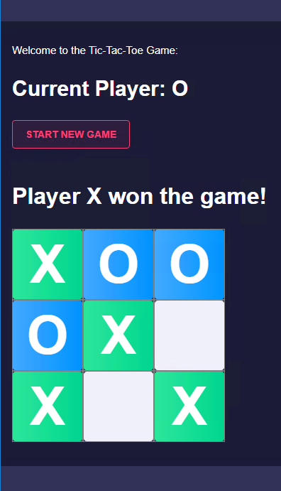
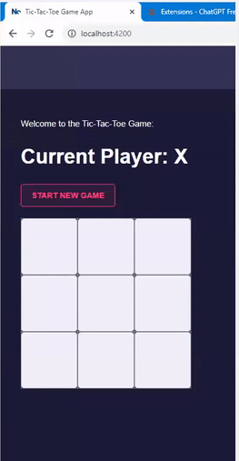
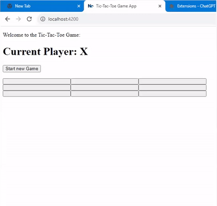

# Angular App - Tic Tac Toe





## Contents
- [Angular App - Tic Tac Toe](#angular-app---tic-tac-toe)
  - [Contents](#contents)
  - [Records](#records)
    - [Part 1: Create Appp - Issue about *Nx Console* repalced *Angular Console*](#part-1-create-appp---issue-about-nx-console-repalced-angular-console)
    - [Part 2: Develop the app's main part using Angular](#part-2-develop-the-apps-main-part-using-angular)
    - [Part 3: Beautify - Issue about Nebula theme](#part-3-beautify---issue-about-nebula-theme)


## Records

### Part 1: Create Appp - Issue about *Nx Console* repalced *Angular Console*

```
$cd angular_app_tic_tac_toe
$npm install -g @angular/cli
$ng new myapp

- Choose SCSS when asking CSS/SCSS/Sass/Less
- Do you want to enable Server-Side Rendering (SSR) and Static Site Generation (SSG/Prerendering)? Yes
```

Because *Angular Console* doesn't exist anymore. *Nx Console* replaced it.

And *Nx console* doesn't recognize the above created "myapp" folder. 

So I use Nx to create the "myorg" folder/workspace.

```
\angular_app_tic_tac_toe> npx create-nx-workspace

 >  NX   Let's create a new workspace [https://nx.dev/getting-started/intro]

√ Where would you like to create your workspace? · myorg
√ Which stack do you want to use? · angular
√ Integrated monorepo, or standalone project? · standalone
√ Which bundler would you like to use? · esbuild
√ Default stylesheet format · scss
√ Do you want to enable Server-Side Rendering (SSR) and Static Site Generation (SSG/Prerendering)? · Yes
√ Test runner to use for end to end (E2E) tests · cypress
√ Set up CI with caching, distribution and test deflaking · skip
√ Would you like remote caching to make your build faster? · skip
```

The "myapp" and "myorg" folder actually have very similar file architecutre.

The "myapp" is useless for me.


### Part 2: Develop the app's main part using Angular


Next I will follow steps in the [previous video](https://www.youtube.com/watch?v=G0bBLvWXBvc&list=PL0vfts4VzfNjsTV_6i9a9iczMnthWqHzM&index=9) to develop the tic tac toe app but inside the "myorg" folder.


For those steps following videos, please see may commits:

When the video use Angular Console, just replace with Nx console which are similar:
- [https://github.com/DayuanTan/angular_app_tic_tac_toe/commits/main/](https://github.com/DayuanTan/angular_app_tic_tac_toe/commits/main/)
    - http://localhost:4200/ shows square works!
    - add a random number property in component class then bind it to the template
    - a random number changes every 500 ms works well
    - generate a board component with default setting
    - game works now with plain ui





### Part 3: Beautify - Issue about Nebula theme

Next, use [Nebula](https://akveo.github.io/nebular/docs/guides/install-nebular#install-nebular) to make it more beautiful. 

Different than the video, inside nx workspace we cannot ```ng add @nebular/theme``` as the video did.

If we do, it shows error: "Error: This command is not available when running the Angular CLI outside a workspace."

So what I did is:
- Follow the "Mannual" section of [Nebular offcial guide](https://akveo.github.io/nebular/docs/guides/install-nebular#using-angular-cli)
    - Install
        - ```npm install --save @nebular/theme @angular/cdk @angular/animations```
        - ```npm install --save eva-icons @nebular/eva-icons```
    - Configure Nebular
        - Use *Nx Console*'s  "generate -- @schematics/angular - module" to "Create an Angular module":
            - "name" typed in "nebular"
            - "project" chosed "myorg"
            - All others are by default
        - The result please check [myorg/src/app/nebular/nebular.module.ts](myorg/src/app/nebular/nebular.module.ts)
    - Install Styles
        - The guide said "angular.json" file. But we don't have it.
        - So I added it into [myorg/project.json](myorg/project.json)
- Add other necessary files:
    - Created [myorg/src/themes.scss](myorg/src/themes.scss)
    - Added content into [myorg/src/styles.scss](myorg/src/styles.scss)
    - Added content into [myorg/src/app/app.component.html](myorg/src/app/app.component.html)
    - Then of courses, import necessary parts in each *.component.ts files. 


